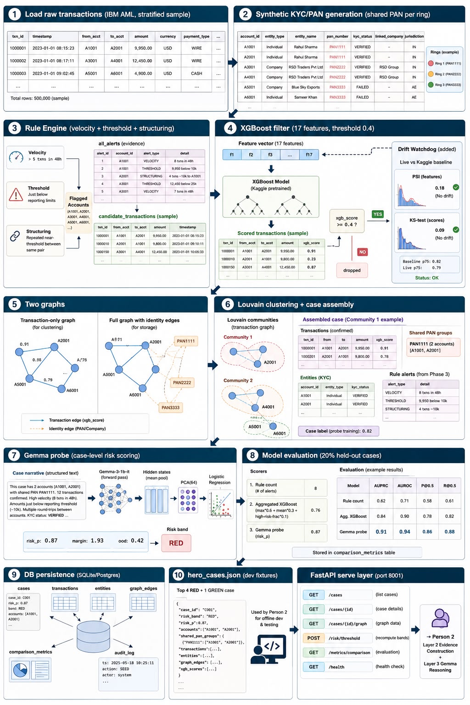
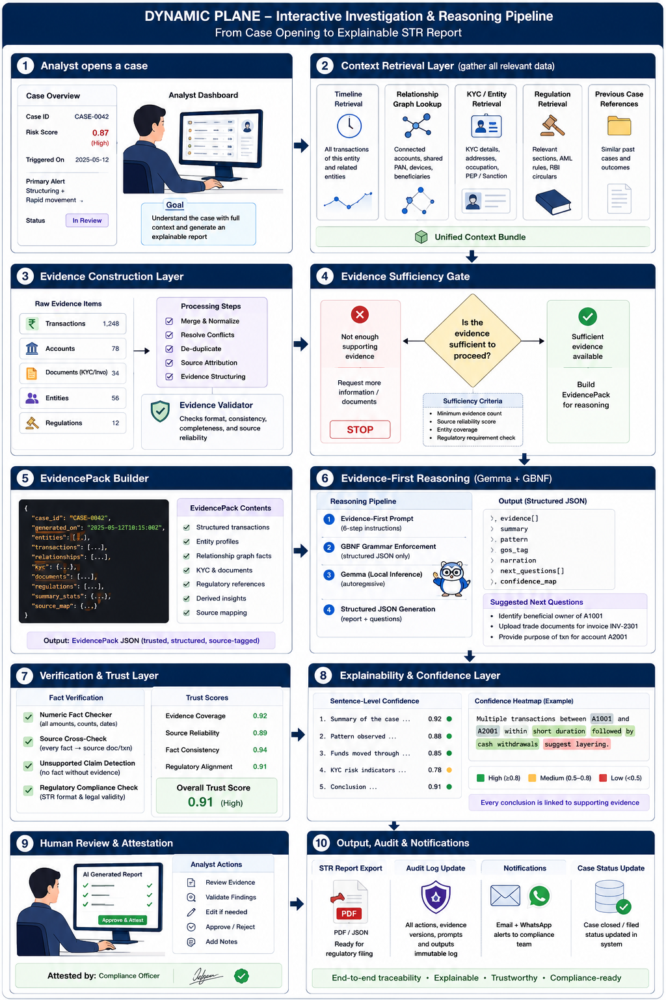

# viGEMMAlya

**Build with Gemma: Bengaluru AI Sprint — Track 2: Gemma Financial Compliance & Risk Triage**

An **air-gapped AML co-investigator** for small NBFCs and co-operative banks. It turns a raw transaction feed into a handful of risk-scored, investigable cases; reconstructs each case's evidence (timeline, entity relationships, KYC red flags, regulation citations); reasons over that evidence with a **locally-run Gemma model under schema-constrained decoding**; drafts a filing-ready FIU-IND Suspicious Transaction Report whose every sentence is scored by the model's own confidence; and — the moment a human attests — emails a formatted report and pushes a WhatsApp/SMS summary automatically.

Not a single byte of customer data ever leaves the machine it runs on.

---

## Table of contents

- [The problem](#the-problem)
- [Why local Gemma, specifically](#why-local-gemma-specifically)
- [System architecture](#system-architecture)
  - [Static plane — data & intelligence engine (`engine/`, port 8001)](#static-plane--data--intelligence-engine-engine-port-8001)
  - [Dynamic plane — reasoning & evidence service (`reasoning/`, port 8002)](#dynamic-plane--reasoning--evidence-service-reasoning-port-8002)
- [Repo layout](#repo-layout)
- [Tech stack](#tech-stack)
- [Running it](#running-it)
- [API surface](#api-surface)
- [Dataset](#dataset)
- [Demo script](#demo-script)
- [Evaluation rubric mapping](#evaluation-rubric-mapping)
- [Submission form answers](#submission-form-answers)
- [Known limitations / roadmap](#known-limitations--roadmap)
- [Further reading](#further-reading)

---

## The problem

Every reporting entity in India — a five-person co-operative bank or a national bank — has the same legal clock: investigate a suspicious transaction and file an STR with FIU-IND within **7 working days**, under steep per-day penalties for missing it. Small NBFCs and co-op banks carry this exact obligation without the staff a large bank has to meet it.

Two things make it worse:

- **Rule-based alerting produces 90%+ false positives.** A threshold rule ("flag anything over ₹10L") catches everything and nothing — every flag still needs a human to manually pull the transaction history, check for linked accounts, find the right regulation, and write it up. Hours per case.
- **Cloud AML tools are legally off the table.** RBI's data-localization rules and India's DPDP Act mean customer KYC and transaction data cannot leave the institution's premises. This isn't a preference — cloud-hosted AML copilots are simply not usable here.

viGEMMAlya replaces the rigid rule engine with a **tunable, learned risk boundary** that still produces a legible, evidence-linked audit trail — running entirely on-prem, on hardware the institution already owns.

## Why local Gemma, specifically

Gemma runs entirely on-device, and viGEMMAlya is built around exactly what that makes possible:

| Capability | What it is | Why it needs local weights |
|---|---|---|
| **Activation probing for risk scoring** | A trained linear probe reads Gemma's own internal hidden-state representation of a case — not a prompted self-report — via `output_hidden_states=True`, mean-pooled at a middle transformer layer, reduced with PCA(64), classified with a logistic regression. | A cloud completion endpoint returns text. It never exposes internal activations. This is architecturally impossible against an API. |
| **Schema-constrained decoding for the STR** | The ground-of-suspicion tag, the evidence-before-conclusion ordering, and the full JSON shape of every investigation are enforced *during* generation — Ollama compiles a JSON schema into a token-level decoding grammar, so an invalid legal category isn't filtered afterward, it's a byte sequence the sampler can never produce. | Requires control over the sampler / logit masking at generation time — a hosted chat completion API only ever returns the finished text. |
| **Token log-probabilities → confidence heat-map** | Every STR sentence is scored by the mean of its own generation-time token logprobs, exponentiated into a 0–1 confidence, then discounted by an independent check that every cited figure actually exists in the ledger. A fluent sentence citing an unverifiable number is still forced red. | Per-token probabilities are a local-inference primitive most hosted chat APIs don't expose in a form usable this way. |

None of activation probing, logit-masked decoding, or per-token confidence is possible against a cloud API that only exposes text. Cloud AI is also legally out of scope here regardless — Gemma isn't a convenience, it's the only architecture that is both compliant *and* instrumentable enough to build a trust layer on top of.

---

## System architecture

The system is two independently-built planes that merge over one frozen contract (`shared_contracts.py`). Full phase-by-phase design docs with diagrams for each live in [`static_plane_diagrams/`](static_plane_diagrams/) and [`dynamic_plane_diagrams/`](dynamic_plane_diagrams/) — the pictures below are the summary view of each.

### Static plane — data & intelligence engine (`engine/`, port 8001)



Runs in two modes: **seed mode** does the heavy one-time work of building the database; **serve mode** is a thin, fast read API on top of what seed mode built. An analyst's click never triggers seed-mode work — by the time the reasoning plane calls the API, everything below has already run.

```
Pre-pipeline (loaded once)
  ├─ XGBoost: trained OFFLINE on Kaggle, on all 5,078,345 IBM AML transactions
  │            → AUROC 0.934 at transaction level → exported as native XGBoost JSON
  └─ Gemma probe: CANNOT train until cases exist — trained on the first full
               pipeline run, then saved and loaded on every run after

Phase 1 — Load raw transactions
  HI-Small_Trans.csv (IBM AML, 5M rows) → fix duplicate "Account" column →
  coerce types → stratified sample by is_laundering (keeps the ~0.1% ratio)

Phase 2 — Synthetic KYC / PAN generation
  Find real laundering rings (connected components of accounts that transact
  with each other AND have laundering transactions) →
    ring accounts:  ONE shared synthetic PAN (= one beneficial owner),
                    KYC FAILED/PENDING, Shell Company, High Risk jurisdiction
    clean accounts: unique PAN, KYC VERIFIED, Individual/Registered Business
  Rule engine + XGBoost are deliberately blind to these columns — pure
  transaction behaviour only, until Phase 6.

Phase 3 — Rule engine (coarse filter, transaction columns only)
  Velocity (>5 txns / rolling 48h) · Threshold (near statutory reporting
  limits) · Structuring (repeated near-threshold txns, same sender→receiver)
  → flagged_accounts + all_alerts (evidence, doesn't drive filtering)

Phase 4 — XGBoost (transaction-level refinement)
  17 features (log-amount, hour, is-night, currency mismatch, near-threshold
  flags, percentile-vs-dataset flags, ...) → xgb_score 0–1 per transaction →
  keep if score ≥ 0.4 (auto-lowers to 0.3, then to a fixed top-N, if too few
  transactions survive — never write an empty/broken seed)
  ⤷ ADDED: drift watchdog — PSI/KS-test of the live feature + score
    distribution against the frozen Kaggle baseline; flags a stale threshold
    without needing a live retrain

Phase 5 — Graph construction (two graphs, different jobs)
  transaction-only graph (accounts + confirmed txns, weight = xgb_score)
    → feeds Louvain clustering, NO synthetic identity edges
  full graph (+ Account→PAN, Account→Company edges from KYC)
    → stored + served to Person 2, never used for clustering

Phase 6 — Louvain clustering + case assembly
  Each community → one case: transactions, KYC records, shared_pan_groups
  (the single strongest evidence — "N accounts, one beneficial owner"),
  filtered rule alerts, a continuous laundering-fraction label (probe
  training only). Duplicate-account and oversized-community cleanup keeps
  every case demo-safe (cap: 50 txns / 30 entities).

Phase 7 — Gemma probe risk scoring
  Serialize case → forward pass through google/gemma-3-1b-it →
  mean-pool a middle hidden layer → PCA(64) → logistic regression →
  (risk_p, margin, ood) → RED ≥0.7 / YELLOW ≥0.4 / GREEN <0.4
  Falls back to TF-IDF vectorization if Gemma can't load (OOM, missing
  files) — same PCA/classifier path, same output shape either way.

Phase 8 — Model evaluation
  On 20% held-out cases: rule-count baseline vs. aggregated XGBoost
  (max·0.6 + mean·0.3 + high-risk-fraction·0.1) vs. Gemma probe —
  AUPRC / AUROC / precision@0.5 / recall@0.5 for all three, honestly.

Phase 9 — Persistence (SQLite, Postgres-swappable)
  cases · transactions · entities · graph_edges · comparison_metrics ·
  audit_log (SEED / RESCORE / THRESHOLD_CHANGE, with actor + timestamp)

Phase 10 — Fixtures
  Top 4 RED-band + 1 GREEN-band case → engine/fixtures/hero_cases.json —
  fully populated, so Person 2 builds and demos without a 5M-row pipeline.

Serve mode (FastAPI, port 8001)
  /health · /cases · /cases/{id} · /cases/{id}/graph ·
  /risk/threshold · /metrics/comparison(+/full)
```

### Dynamic plane — reasoning & evidence service (`reasoning/`, port 8002)



Everything here runs **interactively** — an analyst opens a case and the whole pipeline below completes without a batch job in the way.

```
Analyst opens a case
        │
        ▼
┌─────────────────────────── LAYER 2 — Evidence Construction ───────────────┐
│  Timeline service    sorts this case's transactions by time                │
│  Relationship logic  walks the case's graph_edges/entities for shared PAN, │
│                      shared director, repeat beneficiary, circular flow    │
│  Document service    stubbed synthetic KYC/invoice fixtures (honestly      │
│                      labelled as such — see Known limitations)             │
│  Regulation lookup   local embedding search (nomic-embed-text via Ollama)  │
│                      over a curated PMLA/RBI/FIU-IND corpus                │
│                              │                                            │
│                              ▼                                            │
│                     EVIDENCE VALIDATOR — hard gate                        │
│         ≥3 txns · ≥1 relationship · ≥1 regulation citation ·               │
│         every item traceable to a source_ref                              │
│         MISSING → STOP. Return INSUFFICIENT_EVIDENCE. Layer 3 never runs. │
└─────────────────────────────────────────────────────────────────────────┘
                              │ evidence sufficient
                              ▼
┌─────────────────────────── LAYER 3 — Gemma Reasoning ──────────────────────┐
│  Evidence-first prompt (6 steps): list evidence → summarize → determine    │
│  pattern → judge sufficiency → suggest next questions → draft the STR      │
│                                                                             │
│  Why evidence-first, not conclusion-first: Gemma is autoregressive — if it │
│  writes the conclusion FIRST, every following word must stay consistent    │
│  with a claim already on the page, so it invents supporting "evidence" to  │
│  justify itself and can't take it back. Evidence-first flips that: real    │
│  evidence is already in context before the model is allowed to conclude.   │
│                                                                             │
│  Enforced three ways, weakest to strongest:                               │
│    1. PROMPT   — 6-step instructions (a suggestion)                       │
│    2. SCHEMA   — Ollama compiles the JSON schema into a decoding grammar; │
│                  gos_tag is drawn from a CLOSED 8-value dictionary that    │
│                  is structurally unreachable outside that list — invalid  │
│                  tokens are masked before sampling, not filtered after     │
│    3. CODE GATE — if evidence is empty, the model is never even called    │
│                              │                                            │
│                              ▼                                            │
│           gemma4 (Ollama) — single pass, logprobs on                      │
│                              │                                            │
│                              ▼                                            │
│   evidence_assessment[] · behaviour_pattern · evidence_sufficiency ·       │
│   investigation_summary · suggested_questions[] · gos_tag · narration[] · │
│   amounts_cited[] · recommended_action                                    │
└─────────────────────────────────────────────────────────────────────────┘
                              │
                              ▼
┌─────────────────────────── LAYER 4 — Trust & Export ───────────────────────┐
│  Grounding check   every cited amount + EV-id verified against the real    │
│                    ledger — a hallucinated figure can't render green      │
│  Confidence fusion token logprobs × grounding → green/yellow/red per      │
│                    narration sentence                                     │
│  Human review      model drafts, a human attests — nothing files itself   │
│  Export            FIU-IND XML (round-trip parsed before it ships) +      │
│                    hash-chained audit log (tamper-evident: any retro edit │
│                    breaks the chain)                                     │
│  Notify            on attest: formatted HTML report + XML emailed         │
│                    (Resend), summary pushed via WhatsApp/SMS (Twilio) —   │
│                    fails soft, never blocks the export itself             │
└─────────────────────────────────────────────────────────────────────────┘
```

Both planes are wired together over a single frozen `shared_contracts.py`. The reasoning service proxies `/cases*` straight through to the engine — integration day was one environment variable (`ENGINE_API_URL`), not a rewrite.

---

## Repo layout

```
viGEMMAlya/
├── engine/                    Static plane — FastAPI, port 8001
│   ├── ingestion/              CSV load, synthetic KYC/PAN generation
│   ├── rules/                  velocity, threshold, structuring detectors
│   ├── graph/                  networkx graph build + Louvain clustering
│   ├── risk/                   XGBoost, Gemma probe, drift watchdog, comparison
│   ├── db/                     SQLAlchemy models, seed pipeline
│   ├── api/                    FastAPI app
│   ├── notebooks/              Kaggle XGBoost training script
│   ├── fixtures/hero_cases.json
│   └── data/                   xgb_pretrained.json + meta (checked in);
│                                the CSV and trained models are not
│
├── reasoning/                  Dynamic plane — FastAPI, port 8002
│   ├── evidence/                timeline, relationships, documents (stub),
│   │                            regulations (local embedding search), validator
│   ├── investigation/           prompt, pipeline, grounding, confidence
│   ├── serving/                 Ollama client, constrained-decoding schema
│   ├── export/                  FIU XML, hash-chained audit log, notify.py
│   ├── api/                     FastAPI app, live SSE pipeline events
│   └── fixtures/                mock cases, regulation corpus, doc stubs
│
├── frontend/                    Vite + React analyst dashboard (original)
│   └── src/components/CaseView/ Timeline · Graph · Evidence · Investigation ·
│                                 STR + Heatmap
│
├── frontend_starter/             Next.js + Tailwind rebuild (current, in progress)
│   ├── app/cases/                dashboard + case-detail (same 5 views)
│   ├── app/pipeline/              live pipeline visualizer (real SSE events,
│   │                              not a simulated timer)
│   └── components/                theme-toggle (light/dark), landing page,
│                                   case UI ported to the new design system
│
├── static_plane_diagrams/       Phase-by-phase engine design docs + Mermaid
├── dynamic_plane_diagrams/      Layer-by-layer reasoning design docs + Mermaid
├── static_plane_flow.jpeg        ← embedded above
├── dynamic_plane_flow.png        ← embedded above
│
├── shared_contracts.py          Frozen Pydantic contract both planes import
├── change.md                    Every deviation from the original spec, and why
├── v0_backend_spec.md            Full API reference (real captured payloads)
├── writeup.md                    Full project write-up
├── devfolio_content.md           Submission-form copy
└── RUNNING.md                    Step-by-step local run guide
```

---

## Tech stack

**Static plane:** `fastapi`, `pandas`, `networkx` (native `louvain_communities`), `transformers` + `torch` (Gemma-3-1B hidden-state extraction), `scikit-learn` (`PCA`, `LogisticRegressionCV`), `xgboost`, `sqlalchemy` (SQLite, Postgres-swappable via `DATABASE_URL`), `faker`.

**Dynamic plane:** `fastapi`, **Ollama** (chat completions with a JSON-schema-compiled decoding grammar + logprobs, plus `nomic-embed-text` embeddings — no `llama-cpp-python`, `chromadb`, or `torch` needed on this side), `requests`, `pydantic`. Notifications via the **Resend** and **Twilio** REST APIs.

**Frontends:** the original is React + Vite + Tailwind + Recharts + a hand-rolled dependency-free SVG force-graph. The in-progress rebuild is Next.js 16 + React 19 + Tailwind v4 + Radix + Recharts + `next-themes`, talking to the same reasoning-service API and adding a live Server-Sent-Events pipeline visualizer.

---

## Running it

Full step-by-step instructions (prerequisites, health checks between each service, and the exact recovery steps for the two most common local failure modes) are in **[`RUNNING.md`](RUNNING.md)**. Short version:

```bash
# 1. Engine (port 8001) — first run seeds the DB from the CSV
USE_GEMMA=0 python -m engine.db.seed --sample 100000     # first time only
USE_GEMMA=0 python -m uvicorn engine.api.main:app --port 8001

# 2. Reasoning (port 8002) — needs Ollama running with gemma4:latest + nomic-embed-text
cd reasoning
export ENGINE_API_URL=http://localhost:8001
python -m uvicorn api.main:app --port 8002

# 3a. Frontend — original (Vite)
cd frontend && npm install && npm run dev        # http://localhost:5173

# 3b. Frontend — rebuild (Next.js)
cd frontend_starter && npm install && npm run dev  # http://localhost:3000
```

`USE_GEMMA=0` uses the fast TF-IDF probe fallback (no GPU needed); drop it (or set `USE_GEMMA=1`) for real Gemma hidden-state activations. Omitting `ENGINE_API_URL` on the reasoning service runs it against the bundled mock fixtures instead of a live engine — useful for frontend-only work.

To enable attest-time email + WhatsApp notifications, add a `reasoning/.env` (gitignored) with `RESEND_API_KEY`, `REPORT_EMAIL_TO`, `TWILIO_ACCOUNT_SID`, `TWILIO_AUTH_TOKEN`, `TWILIO_FROM_NUMBER`, `TWILIO_TO_NUMBER`. Without it, exports still work — notifications just report `"status": "skipped"`.

---

## API surface

The reasoning service (`:8002`) is the main integration point for a frontend — it proxies case data from the engine and adds everything else on top. Full reference with real captured request/response payloads: **[`v0_backend_spec.md`](v0_backend_spec.md)**.

| Method | Path | Returns |
|---|---|---|
| GET | `/health` | service + Ollama + audit-chain status |
| GET | `/cases`, `/cases/{id}` | case list / full case (proxied from the engine, or mock fixtures) |
| POST | `/evidence/{id}` | the deterministic `EvidencePack` |
| POST | `/investigate/{id}` | the constrained Gemma investigation result |
| GET | `/investigate/{id}/full` | cached result + evidence + run diagnostics |
| GET | `/regulations/search?q=` | semantic search over the regulation corpus |
| POST | `/export/{id}` | attest → FIU-IND XML + audit entry + notification status |
| POST | `/grammar/validate` | live-reject demo: what the decoding grammar refuses |
| GET | `/events/stream` | Server-Sent Events feed of real pipeline stage transitions |
| GET | `/audit/{id}`, `/audit/verify` | per-case audit trail / hash-chain integrity |

The engine (`:8001`) exposes `/health`, `/cases`, `/cases/{id}`, `/cases/{id}/graph`, `/risk/threshold`, `/metrics/comparison(+/full)` — mostly consumed *through* the reasoning proxy rather than called directly.

---

## Dataset

**[IBM Transactions for Anti Money Laundering (AML)](https://www.kaggle.com/)** (`HI-Small_Trans.csv`, ~5.5M rows, Kaggle). All identity data — PAN numbers, shell-company names, KYC status, director/company relationships — beyond the raw transactions is synthetically generated on top of the dataset's real laundering-ring structure, per the hackathon's data policy. No real personal data is used anywhere in the system.

## Demo script

Seed a transaction batch → dashboard collapses hundreds of alerts into a handful of risk-banded cases → open a RED case → timeline, relationship graph, and evidence self-assemble → run the live Gemma investigation (watch the real pipeline stages light up, not a fake progress bar) → a schema-valid STR drafts, sentences colour-banded by the model's own confidence → open the grammar-rejection widget, paste an invalid legal category, watch it get refused, and explain that the same rejection is *impossible to trigger* mid-generation — the tokens are masked before sampling, not filtered after → attest → FIU-IND XML downloads, and the report lands by email + WhatsApp in seconds. For contrast, open a thin, low-evidence case and show the system refusing to draft a report at all.

---

## Evaluation rubric mapping

| Criterion | Weight | Where viGEMMAlya addresses it |
|---|---|---|
| Gemma Integration | 30% | Activation probing (not prompting) for risk scoring, schema-constrained decoding for the STR, native token logprobs for confidence — none possible on a cloud API. |
| Innovation & Impact | 30% | Turns hundreds of noisy alerts into a handful of investigable cases; turns hours of STR drafting into a verify-and-attest step; automatic report delivery on attest; targets a real, underserved segment (small NBFCs/co-ops) with a real legal constraint (data localization). |
| Functionality | 20% | End-to-end working pipeline: ingestion → clustering → risk scoring → evidence → constrained generation → confidence → export → notification. |
| Presentation & Write-up | 20% | This README, the phase-by-phase diagrams, and `writeup.md` / `devfolio_content.md`. |

## Submission form answers

**Track Selection:** Track 2 — Gemma Financial Compliance & Risk Triage.

**AI & Gemma Usage:** Gemma runs entirely on-device, and viGEMMAlya exploits what only local weights allow. Suspicion scoring reads Gemma's internal activations through a trained linear probe (not a prompt), giving a calibrated, tunable decision boundary that attacks AML's 90%+ false-positive problem. The STR is produced under schema-constrained decoding, so the filing physically cannot contain an invalid FIU Ground-of-Suspicion tag or a hallucinated figure. Each narration sentence is scored by Gemma's own token-level logprobs into a confidence heat-map, cross-checked against the real ledger, so the analyst sees exactly which claims to verify before attesting. None of these — activation probing, logit-masked decoding, per-token confidence — is possible against a cloud API, which exposes only text. Cloud AI is also legally impossible here: RBI bars KYC data from third-party servers. Gemma isn't a convenience; it's the only architecture that is both compliant and instrumentable.

**Project Idea:** Small NBFCs and co-op banks carry a disproportionate compliance burden under steep per-day penalties, yet cloud AML tools are off-limits because customer data can't leave their premises. viGEMMAlya is an air-gapped co-investigator that clusters raw transactions into connected cases via graph community detection, reconstructs each case's timeline and entity graph, suggests investigative next steps, cites the relevant PMLA/RBI provision, and drafts a filing-ready FIU-IND STR whose every sentence is heat-mapped by the model's own confidence — then emails and WhatsApps the report the moment a human attests. Target users: compliance/MLRO teams at India's small reporting entities. Impact: turns hundreds of noisy alerts into a handful of investigable cases, turns hours of STR drafting into a verify-and-attest step, and reduces the unnecessary account freezes and onboarding delays that fall hardest on SME customers — without a single byte leaving the building.

---

## Known limitations / roadmap

- **Document/vision extraction is stubbed** with synthetic fixtures for demo reliability — clearly labelled as such wherever it appears. KYC status, entity subtype, and jurisdiction already flow from these stubs into the evidence pack and the STR narrative today; wiring a real Gemma-vision extraction pass over scanned onboarding documents is the direct next step, not a redesign.
- **Regulation retrieval covers a curated subset** of PMLA/RBI/FIU-IND text via local embedding search (`nomic-embed-text` through Ollama), not the full corpus.
- **The activation probe is trained on this dataset's labelled typologies**; a production deployment would need retraining on an institution's own historical STR/CTR outcomes.
- **The Next.js frontend rebuild (`frontend_starter/`) is in progress** alongside the original Vite dashboard — same five case-detail views (Timeline, Graph, Evidence, Investigation, STR + Heatmap), rebuilt on the new design system, plus a real-time pipeline visualizer and a light/dark theme toggle the original doesn't have yet.
- **Notifications are best-effort and fail soft** — a Resend/Twilio hiccup is reported as a status, never blocks the export, since the XML and hash-chained audit entry are already durable before notification is attempted.

## Further reading

- [`writeup.md`](writeup.md) / [`devfolio_content.md`](devfolio_content.md) — the full project write-up and submission-form copy.
- [`RUNNING.md`](RUNNING.md) — step-by-step local run guide with health checks and recovery steps.
- [`static_plane_diagrams/`](static_plane_diagrams/) and [`dynamic_plane_diagrams/`](dynamic_plane_diagrams/) — the phase-by-phase design docs behind the two architecture diagrams above.
