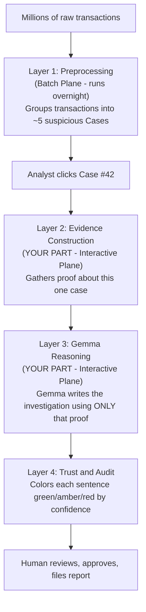

# SentinelAI — Overview (Big Picture)

Two speeds: Batch Plane (prep overnight) and Interactive Plane (analyst clicks a case, <2s). Layer 2 and Layer 3 = your part, both in the Interactive Plane.

```mermaid
flowchart TB
    A[Millions of raw transactions] --> B["Layer 1: Preprocessing<br/>(Batch Plane - runs overnight)<br/>Groups transactions into ~5 suspicious Cases"]
    B --> C["Analyst clicks Case #42"]
    C --> D["Layer 2: Evidence Construction<br/>(YOUR PART - Interactive Plane)<br/>Gathers proof about this one case"]
    D --> E["Layer 3: Gemma Reasoning<br/>(YOUR PART - Interactive Plane)<br/>Gemma writes the investigation using ONLY that proof"]
    E --> F["Layer 4: Trust and Audit<br/>Colors each sentence green/amber/red by confidence"]
    F --> G["Human reviews, approves, files report"]
```
