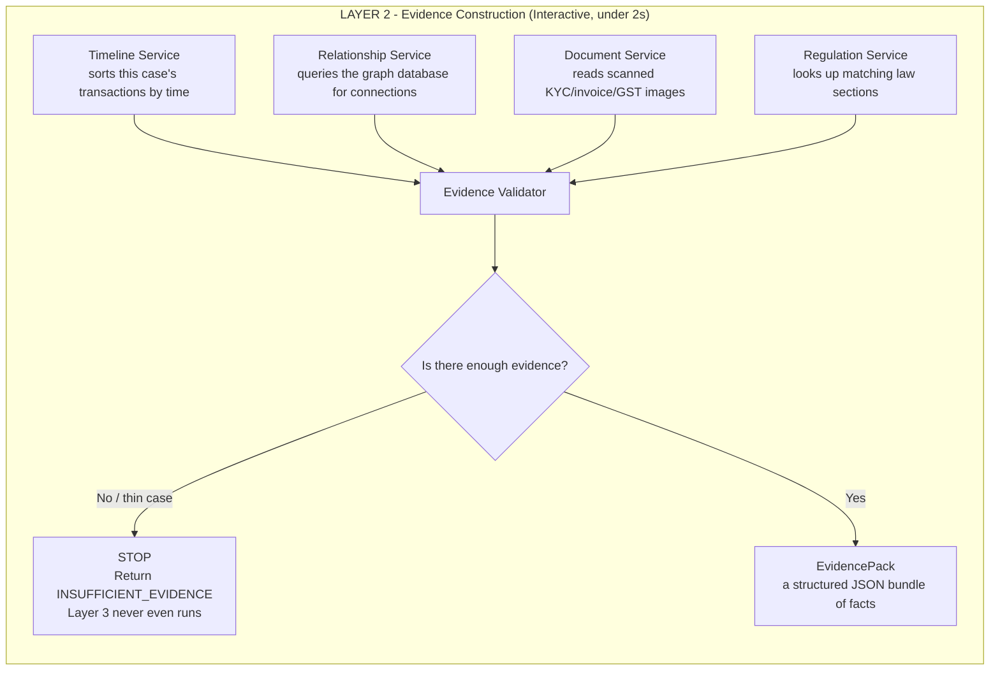

# Layer 2 — Evidence Construction

Before letting the AI write anything, gather every hard fact about the case first — like a detective assembling a case file before writing the report. Zero writing happens here, only gathering, checking, and packaging.

**Service notes:**
- **Timeline Service** — orders transactions by date/time so patterns like structuring (staying just under a reporting threshold) become visible.
- **Relationship Service** — runs Cypher queries (graph-database version of SQL) against Neo4j to find shared directors, shared PAN cards, repeat beneficiaries.
- **Document Service** — uses Gemma's vision component (SigLIP) to read scanned documents and extract fields plus the exact pixel location each fact came from.
- **Regulation Service** — a local RAG system that retrieves the actual relevant law paragraph instead of asking Gemma to recall it from memory.
