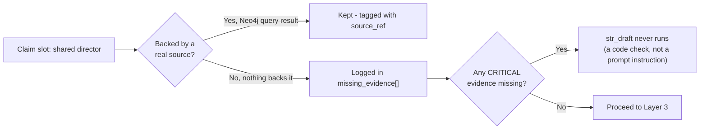

# Layer 2 — Evidence Validator + Hard Gate

Every fact that goes into the pack must be traceable to a real source. If a fact has no source it's flagged as missing, and if that missing fact is critical, plain code refuses to let Layer 3 even start — a hard stop written as an if-statement, not a prompt instruction.

