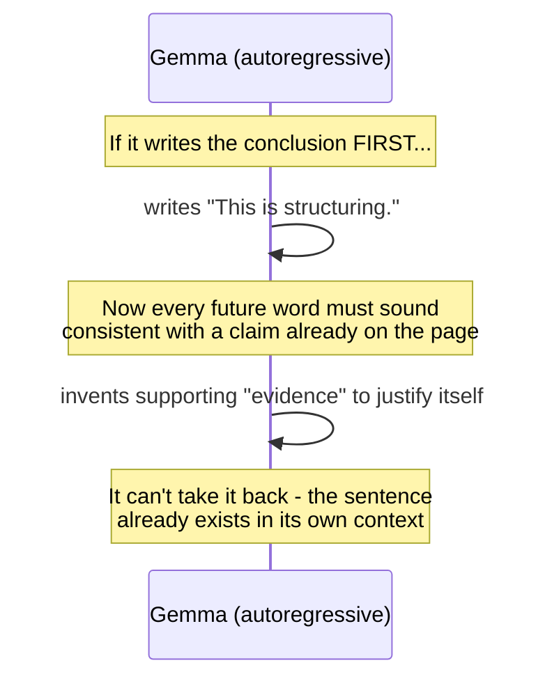
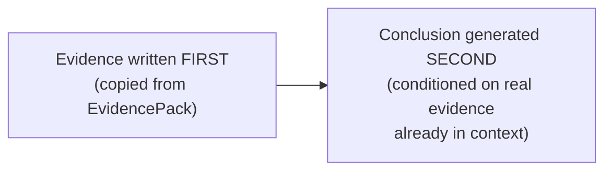

# Layer 3 — Why Conclusion-First Causes Hallucination

Autoregressive means the model writes one word at a time, and each new word is chosen based on all words written so far. If the conclusion is written first, everything after it must stay consistent with a claim already on the page — the model can't take it back.

**The fix — Evidence-First flips the order:**

