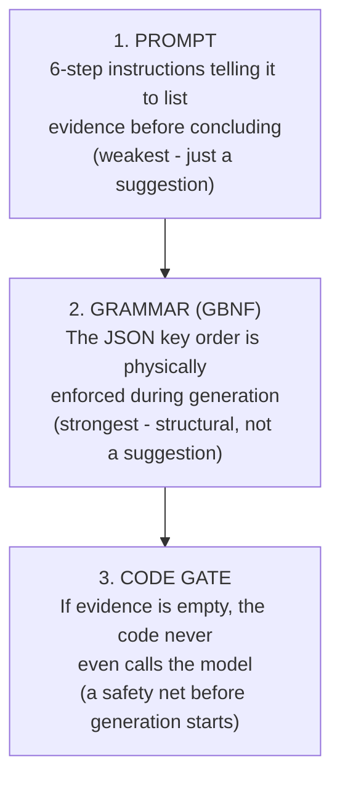

# Layer 3 — Three Enforcement Layers for Evidence-First

Asking nicely in the prompt is not enough — the model can still jump to the conclusion early. Evidence-First is enforced three separate ways, each a backup for the one before it.

