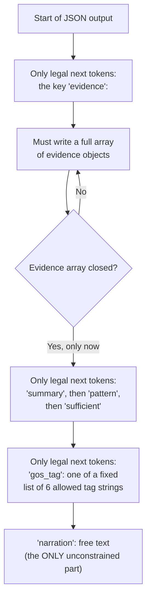

# Layer 3 — GBNF Grammar-Constrained Decoding

Normally the model chooses from its entire vocabulary at every step. Grammar-constrained decoding hands it a much smaller menu of only the tokens that are legal right now, based on a grammar you wrote (GBNF).

**Two gotchas to remember:**
- The grammar file is never shown to the model — it only shapes what tokens are legal. The prompt still has to explain in words "list evidence first, then conclude."
- Grammar guarantees valid structure, not a finished answer — the model can run out of tokens mid-object. Use a generous max_tokens and wrap the parse in try/except.
