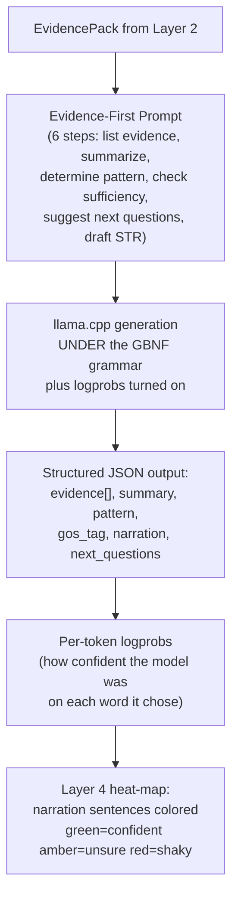

# Layer 3 — End-to-End Flow

**Logprob, in plain terms:** the log of the probability the model assigned to the word it picked. Close to 0 = very sure. Large negative number = it was guessing. Average per sentence, convert back with exp(), and you get a 0-1 confidence score per sentence.
