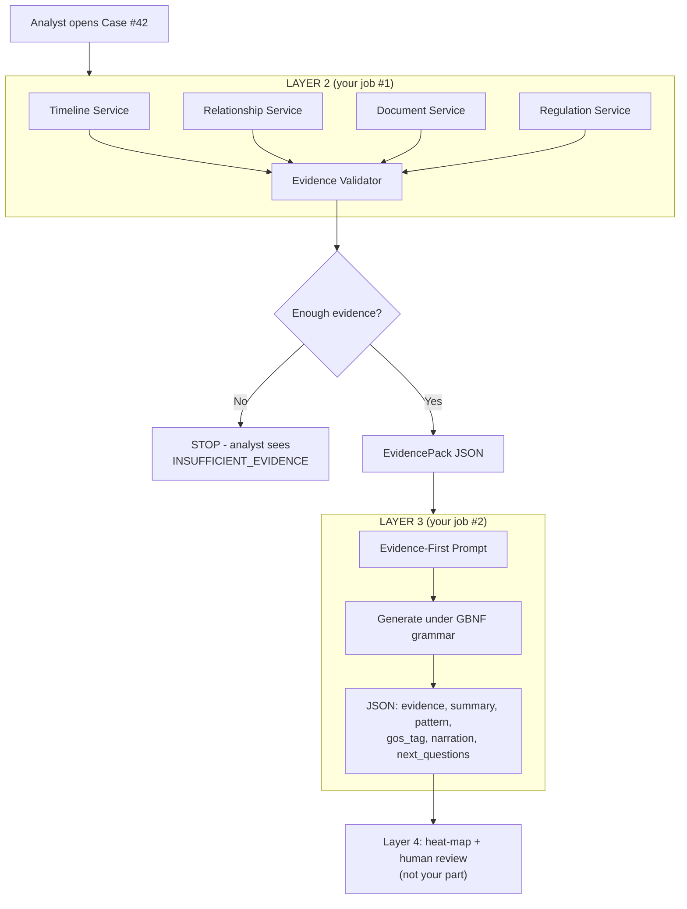

# Layer 2 + Layer 3 — Full Handoff (Your Complete Slice)

```mermaid
flowchart TB
    Case["Analyst opens Case #42"] --> L2

    subgraph L2["LAYER 2 (your job #1)"]
        T[Timeline Service] --> V[Evidence Validator]
        R[Relationship Service] --> V
        D[Document Service] --> V
        Reg[Regulation Service] --> V
    end

    V --> Gate{"Enough evidence?"}
    Gate -- No --> Halt["STOP - analyst sees<br/>INSUFFICIENT_EVIDENCE"]
    Gate -- Yes --> EP[EvidencePack JSON]

    EP --> L3

    subgraph L3["LAYER 3 (your job #2)"]
        Prompt["Evidence-First Prompt"] --> Grammar["Generate under GBNF grammar"]
        Grammar --> Result["JSON: evidence, summary, pattern,<br/>gos_tag, narration, next_questions"]
    end

    Result --> L4["Layer 4: heat-map + human review<br/>(not your part)"]
```
