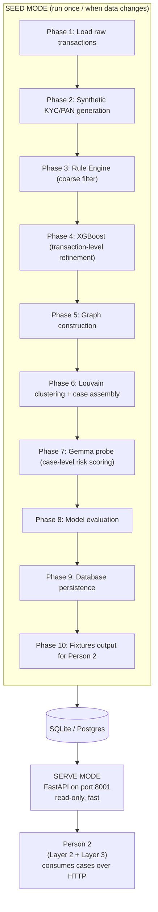

# Person 1 — Overview (Seed Mode vs Serve Mode)

Two separate modes. Seed mode does the heavy one-time work of building the database. Serve mode is just a lightweight API sitting on top of what seed mode already built.

**Key idea to hold onto:** this whole pipeline runs *before* any analyst ever opens the app. By the time Person 2's code runs, all of Person 1's work (rules, XGBoost, clustering, Gemma probe scoring) is already sitting in the database as a finished "case." Person 2 never triggers any of Phases 1–10 directly — Person 2 just calls the API and reads what's already there.
