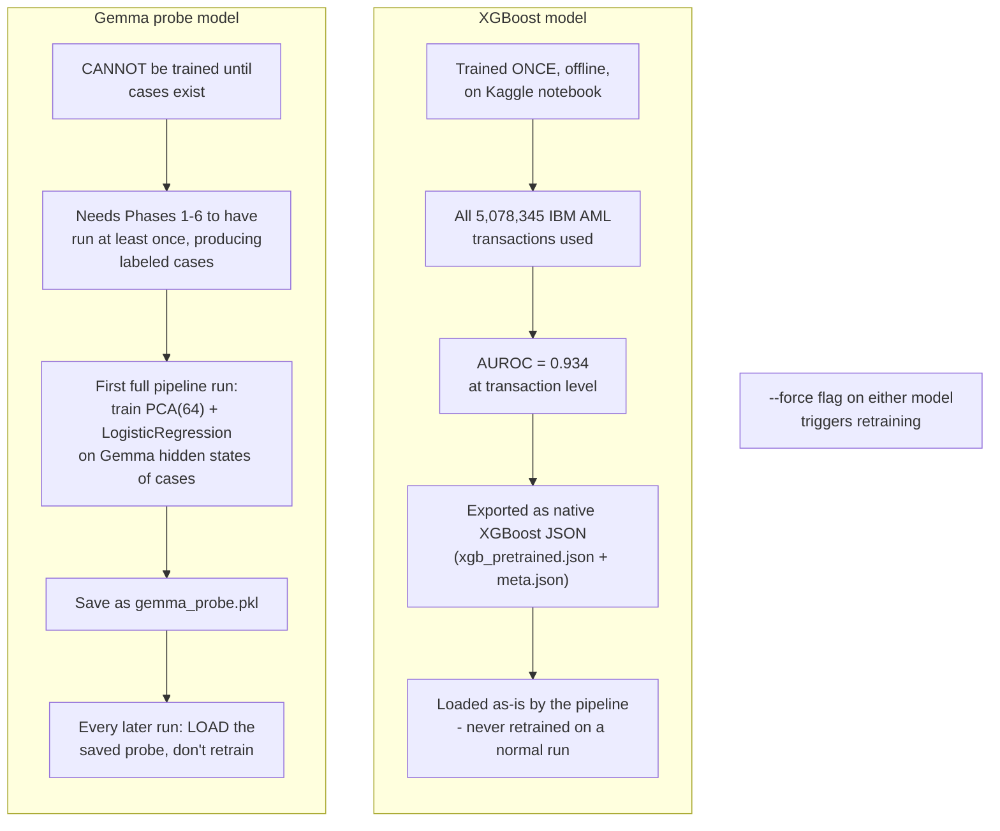

# Person 1 — Pre-Pipeline: Model Artifacts

Two trained models must exist before the pipeline can run properly. They're trained differently and at different times — this trips people up, so it's worth its own diagram.

**Why the difference matters:** XGBoost scores individual *transactions*, so it can be trained straight from the raw Kaggle CSV, entirely separately from this pipeline. The Gemma probe scores whole *cases* (clusters of transactions + KYC + alerts) — and "cases" don't exist until Phases 1–6 have already run once and built some. That's a chicken-and-egg situation, solved by: run the pipeline once with an untrained probe, use that run's cases to train the probe, save it, and use the saved version forever after (until someone passes `--force`).

**Fallback, spelled out plainly:** if the Kaggle-trained XGBoost files are missing, the pipeline can locally train XGBoost on whatever small sample it has — but this is explicitly a lower-quality fallback (far less data), not the intended path.
