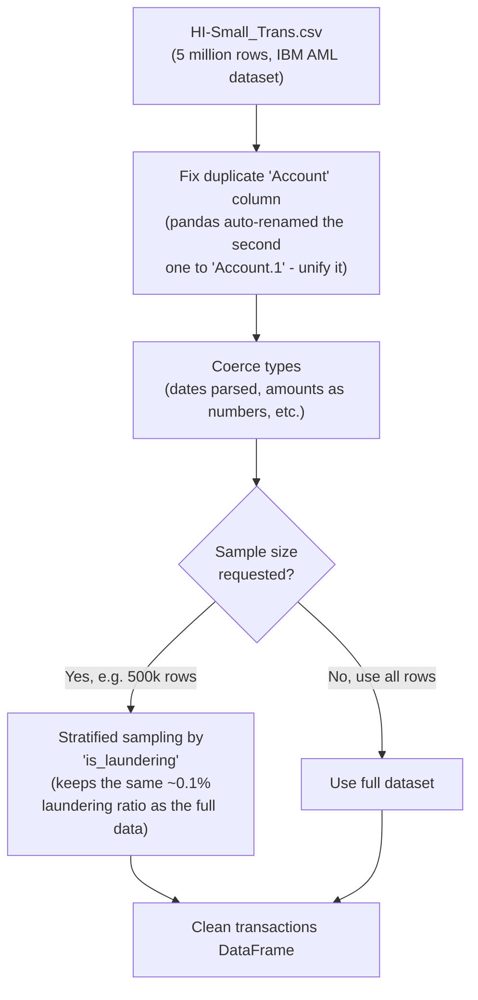

# Person 1 — Phase 1: Load Raw Transactions

The entry point. Reads the raw IBM AML dataset and turns it into a clean DataFrame (a table in memory) the rest of the pipeline can trust.

**Why "stratified" sampling matters:** laundering transactions are only about 0.1% of the data — incredibly rare. If you just grabbed a random 10% of rows, you might end up with almost none of the rare laundering examples, which would make later training useless. Stratified sampling deliberately keeps the *same ratio* of laundering-to-clean transactions in the smaller sample as exists in the full dataset, so a 500k-row sample still has enough real laundering examples to learn from.

**One detail worth remembering:** the `is_laundering` column is ground truth — the actual real answer, only present because this is a research dataset. It gets used later (synthetic identity generation, probe training labels, evaluation) but it is **never sent to Person 2** — Person 2 only ever sees model *predictions*, never the answer key.
