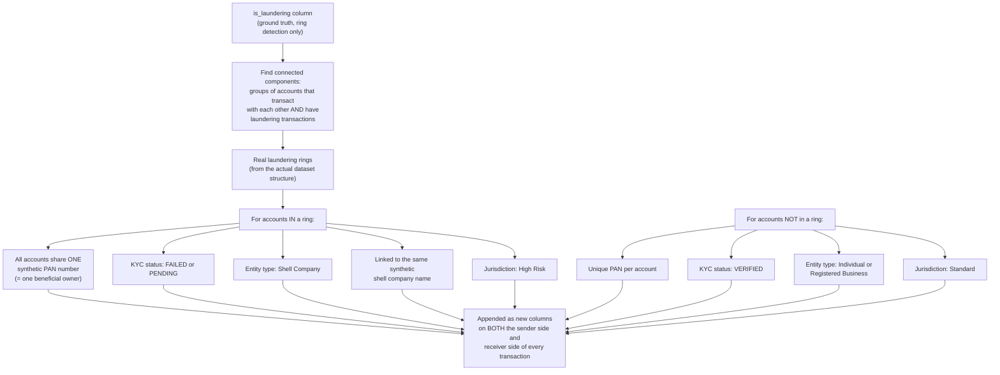

# Person 1 — Phase 2: Synthetic KYC/PAN Generation

The IBM AML dataset only has transactions — no identity documents, no PAN cards, no company names. This phase invents realistic identity data *on top of* the real transaction patterns, so laundering rings become visible through shared ownership, not just suspicious money movement.

**The core idea in one sentence:** the dataset already tells you *which* accounts are truly part of a laundering ring (via `is_laundering` + the transaction graph) — this phase just gives those accounts a realistic paper trail of fake identity documents that *would* exist in real life if one person secretly controlled multiple accounts through a shell company.

**Why "shared PAN" is the single most important thing generated here:** in the real world, one person owning multiple bank accounts under different names is exactly how layering works. Giving every account in a real ring the *same* fake PAN number recreates that signal artificially — and it becomes the strongest, single clearest piece of evidence Person 2 can cite later ("these 3 accounts share one PAN — one entity controls all three").

**What Phase 3 onward can and can't see:** these new KYC columns get glued onto the transaction table, but the Rule Engine and XGBoost (next two phases) are deliberately kept blind to them — they only look at transaction behavior. The KYC columns just ride along silently until Phase 6, where they finally get used.
