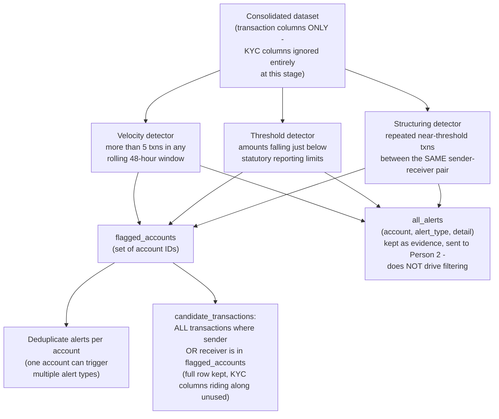

# Person 1 — Phase 3: Rule Engine (Coarse Behavioral Filter)

First pass over the full dataset. Cheap, deterministic, transaction-behavior-only — the same three ideas as before, but now scoped precisely to what this build actually does.

**Important nuance versus a simpler design:** `all_alerts` is *not* a filter — it's evidence that gets carried all the way to the final case output for Person 2 to cite, but it has zero effect on which transactions survive to the next phase. The thing that actually decides what survives is `flagged_accounts`: any transaction touching a flagged account (as either sender or receiver) becomes a `candidate_transaction`. Filtering happens by *account*, but evidence is recorded by *alert*.
