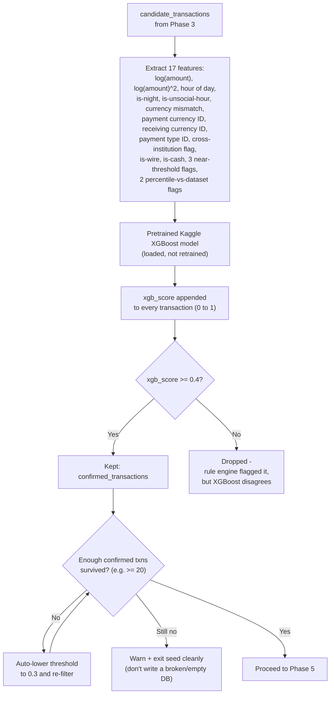

# Person 1 — Phase 4: XGBoost (Transaction-Level Refinement)

Second pass. Scores each candidate transaction individually with the pretrained model and drops the ones XGBoost disagrees with.

**Why this step exists at all, given the Rule Engine already ran:** rules are deliberately dumb and wide (they're designed to catch *everything that might be suspicious*, tolerating false alarms). XGBoost is the model that actually learned, from 5 million real labeled transactions, what genuinely suspicious behavior looks like statistically — so it acts as a smarter second opinion that narrows the wide net the Rule Engine cast. A transaction has to pass *both* checks to be considered "confirmed."

**The 0.4 → 0.3 auto-lowering step is a practical safety valve:** Louvain clustering (next phase) needs a reasonable number of transactions to find meaningful communities in. If the threshold is too strict and almost nothing survives, there's nothing left to cluster — so the threshold automatically relaxes once, rather than the whole pipeline silently producing zero cases.
