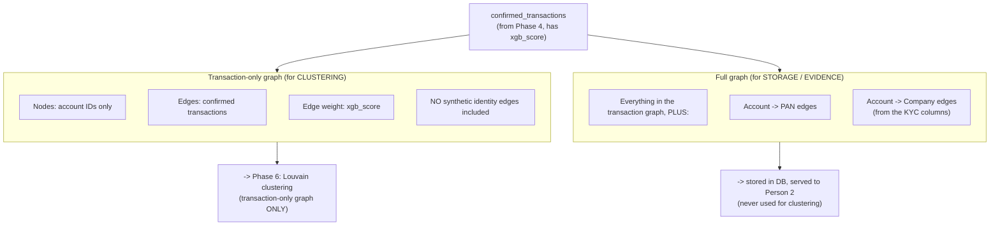

# Person 1 — Phase 5: Graph Construction

Builds TWO separate graphs from the same confirmed transactions — one deliberately narrow (for clustering), one deliberately rich (for storage and evidence). Mixing these up is a common design mistake this phase avoids on purpose.

**Why identity edges are deliberately excluded from clustering:** the whole point of clustering is to group accounts because their *money movement* looks suspicious together. The synthetic PAN/company edges from Phase 2, even though they're designed to mimic real laundering structure, are still artificially inserted data — letting Louvain cluster on them too would mean the clustering algorithm is partly grouping accounts by a signal you *invented*, which would distort the result and make the "5 cases found by pure transaction-graph analysis" story less honest. Keeping clustering blind to identity data, and only bringing identity data back in afterward (Phase 6) as supporting evidence, keeps the two jobs — "find the ring" and "explain who owns it" — cleanly separated.
