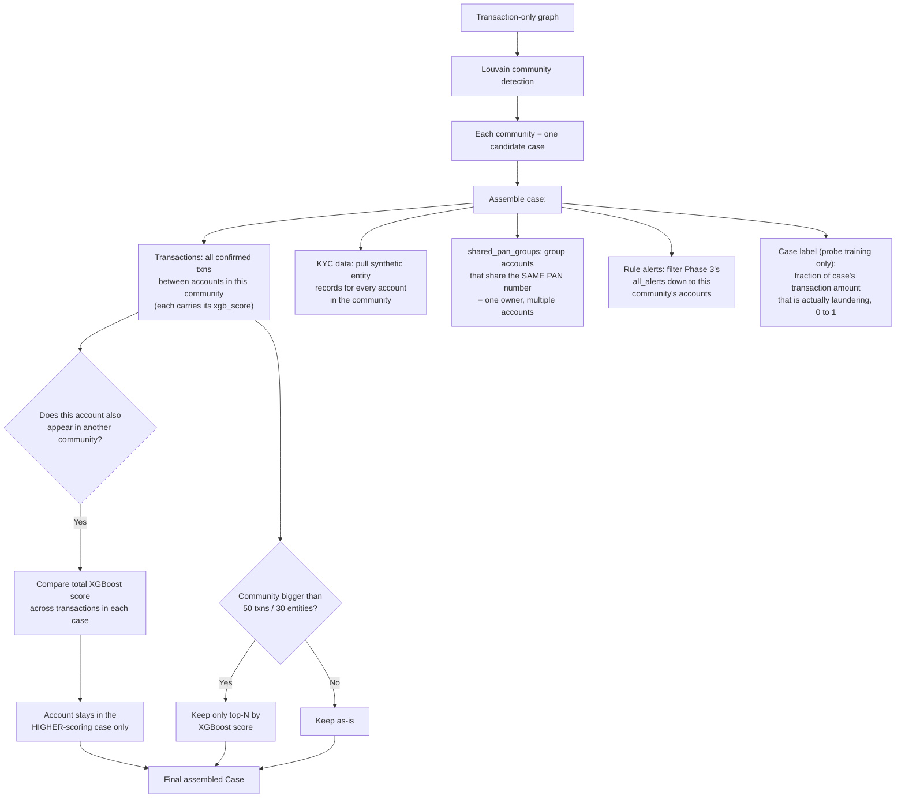

# Person 1 — Phase 6: Louvain Clustering + Case Assembly

Louvain finds the fraud rings (same idea as before), but case assembly now has three cleanup steps this version specifies precisely: shared-PAN detection, cross-community dedup, and size capping.

**Why `shared_pan_groups` is the headline field:** everything else in this pipeline is statistical suspicion. This one is close to direct proof — if three accounts that look unrelated on the surface all share one PAN number, that's one real person or entity secretly controlling all three. It's the single strongest, most citable fact in the whole case file, which is why it gets called out as first-class evidence rather than buried inside the entity records.

**Why dedup and size-capping matter for a demo:** without dedup, the same suspicious account could show up in two different "rings" on screen, which looks like a bug. Without a size cap, Louvain occasionally produces one giant blob community (a known quirk on dense real-world graphs) that would make one "case" contain hundreds of accounts — impossible for an analyst or for Gemma to reason about in one pass.
