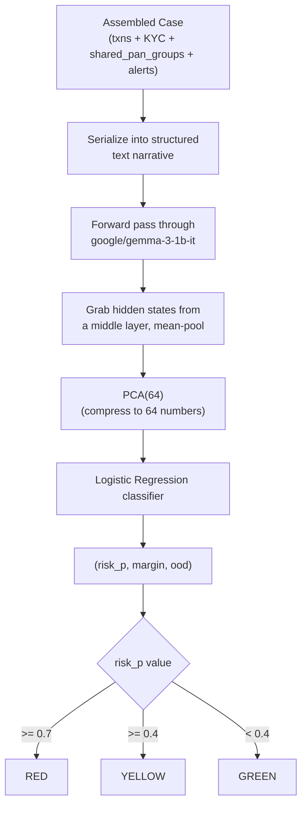

# Person 1 — Phase 7: Gemma Probe Risk Scoring

Scores a whole **case** (not a single transaction) using everything assembled so far — transaction patterns, KYC red flags, shared PAN groups, and rule alerts, all serialized into one text narrative Gemma reads in a single forward pass.

**Training is a chicken-and-egg situation, solved with a bootstrap:** unlike XGBoost (trained once offline on Kaggle, before the pipeline even exists), the probe needs *assembled cases* to train on — and cases only exist after Phases 1-6 have already run. So: the **first full pipeline run trains the probe** (80% of that run's cases for training, 20% held out for testing, using the continuous case label from Phase 6 thresholded at 0.05) and **saves it**. Every run after that just **loads** the saved probe — fast, and consistent. `--force` is the flag that throws the saved probe away and retrains.

**Fallback, not a design choice — a safety net:** if Gemma fails to load (segfault, out of memory, missing files), the probe automatically swaps in TF-IDF (bag-of-words text vectors) instead of Gemma's hidden states for that one step. PCA and Logistic Regression afterward are unchanged, so the output shape stays identical either way — Person 2 downstream never has to know or care which mode produced a given score.

**What `ood` means here:** Mahalanobis distance from the training distribution — how far this case's vector sits from anything the probe has seen before. A high value is a flag to a human: "trust this score less, this case pattern is genuinely new."
