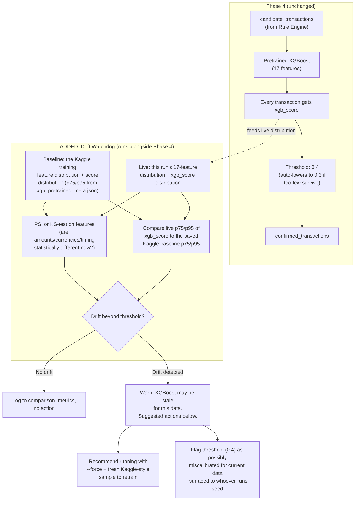

# ADDED — XGBoost Drift Detection (not in Person 1's original spec)

Person 1's XGBoost is a **static, frozen artifact** — trained once on 5M Kaggle rows, then just *loaded* on every normal run, never retrained unless Kaggle files are missing. That's fine for a hackathon demo, but it means the model has zero awareness of whether live transactions still look like what it trained on. This adds a watchdog around Phase 4 without touching how Phase 4 itself works.

**Why this reuses stuff Person 1 already built, instead of adding new infrastructure:** the Kaggle training metadata file (`xgb_pretrained_meta.json`) already stores `p75` and `p95` of the training score distribution — that was built for threshold selection, but it's exactly the baseline a drift check needs too. Same with `comparison_metrics` (Phase 8) — it's already the table built to answer "is this model still good?", so drift results log into the same place instead of inventing a new one.

**Why this doesn't touch the actual filtering logic:** the drift watchdog only *reads* the same feature vectors and scores that Phase 4 already computes — it runs alongside Phase 4, not inside its decision path. If it flags drift, nothing about this run's `confirmed_transactions` changes; it just raises a warning for a human (or a future automated retrain trigger) to act on. That keeps Person 1's existing, tested filtering behavior completely untouched.

**Two simple terms used above:**
- **PSI (Population Stability Index):** a standard number that measures "how much has this distribution of values shifted compared to a baseline" — small PSI means stable, large PSI means the data has moved.
- **KS-test (Kolmogorov-Smirnov test):** a statistical test that answers "are these two sets of numbers likely drawn from the same underlying distribution, or not" — used here to compare today's feature values against the Kaggle training values.
