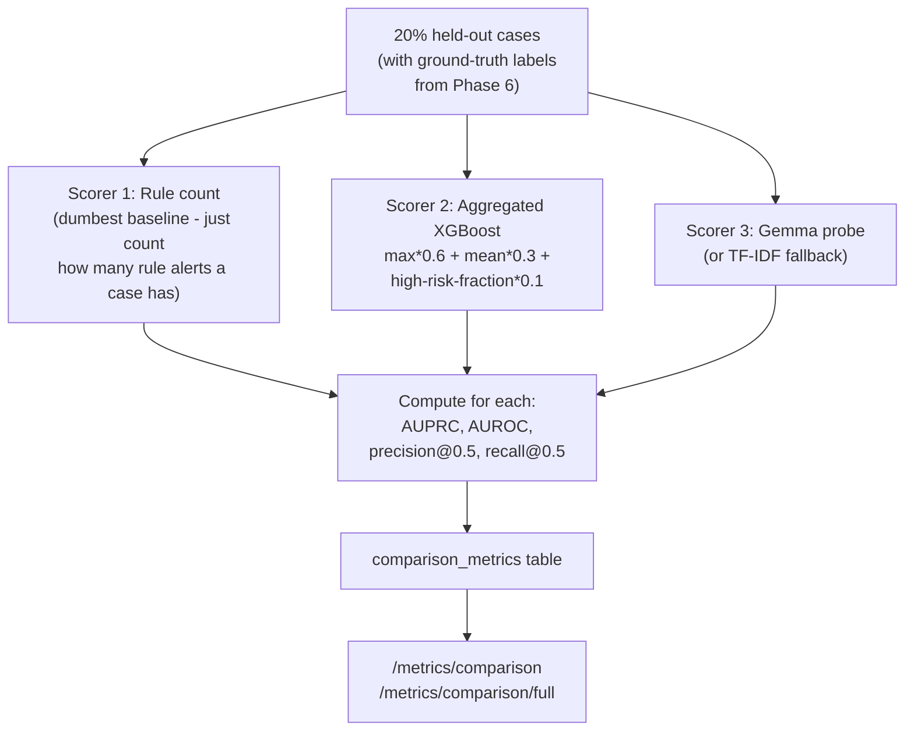

# Person 1 — Phase 8: Model Evaluation

The phase that answers "is any of this actually working, or would a simpler approach do just as well?" — three scorers, ranked from dumbest to smartest, evaluated on the same held-out cases.

**Why compare all three instead of just trusting the fanciest one:** this is the honest version of "does the AI actually help?" If the Gemma probe doesn't clearly beat aggregated XGBoost, and XGBoost doesn't clearly beat simple rule-counting, that's important to know — and worth showing a judge, since it proves the numbers aren't cherry-picked. **Note the aggregation formula for Scorer 2** — it turns a *list* of per-transaction xgb_scores (Phase 4 output) into one *case-level* number using a weighted blend of the highest score, the average score, and the fraction of transactions that were "high risk" — that's what makes it comparable apples-to-apples against the probe's single per-case `risk_p`.
