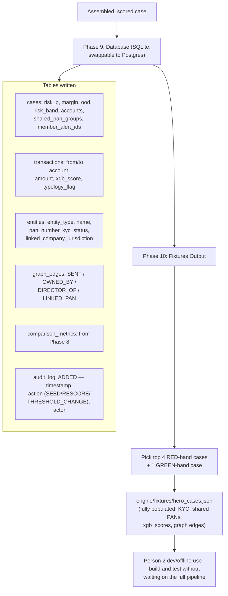

# Person 1 — Phase 9 & 10: Persistence + Fixtures

Everything assembled gets written to a database, plus a small hand-picked sample gets exported as a standalone file so Person 2 can build against it without waiting for the full pipeline to run.

**Why `audit_log` matters even though it's "just" a logging table:** it's what makes every case traceable later — who/what/when for every write. It's already defined in the schema; the only remaining work is actually populating it on every write, which is a small but important gap to close for compliance credibility, since a judge asking "how do you know nothing was tampered with after the fact" gets answered by this table, not by anything AI-related.

**Why a curated fixture file matters for a two-person team:** hero_cases.json means Person 2 (evidence construction + Gemma reasoning) never has to wait for a 5-million-row pipeline to finish just to test a UI tab or a prompt — 5 realistic, fully-populated cases spanning the whole risk spectrum (RED to GREEN) are enough to build and demo against in isolation.
