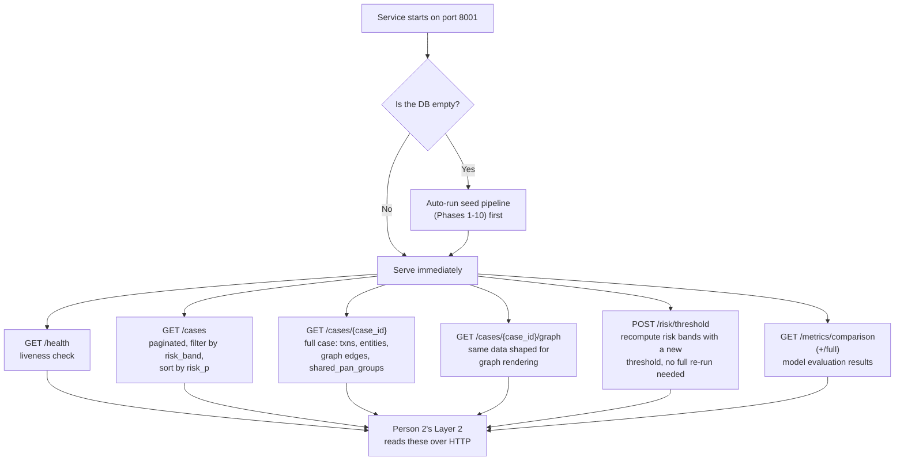

# Person 1 — API Layer (Serve Mode)

Once seeding is done, a FastAPI service exposes everything to Person 2 over HTTP. This is the actual contract boundary between the two of you.

**Two known gaps worth knowing about, since they'll bite before demo day if ignored:**
- **Pagination:** `/cases` currently hard-caps at 200. A full 5M-row run can produce thousands of cases — proper limit/offset pagination needs to go in before that becomes a problem.
- **CORS/auth:** currently wide open (`*`), which is fine for local dev on the same laptop, but should be locked down to just Person 2's service origin before any non-local demo setup (e.g. two laptops on venue wifi).

**What actually matters for you (Person 2) in the response payload:** `shared_pan_groups` (lead evidence — one owner, multiple accounts), `xgb_score` per transaction (a citable machine-learned anomaly number, e.g. "flagged with an XGBoost anomaly score of 0.91 against a 5M-transaction baseline"), `kyc_status`/`entity_type` per entity (directly citable risk indicators like FAILED KYC or Shell Company), and `alert_details` (formatted rule violations ready to drop into your evidence pack). Every one of these lets your Layer 2 evidence be grounded in a real structured field instead of something Gemma has to infer from raw numbers.
