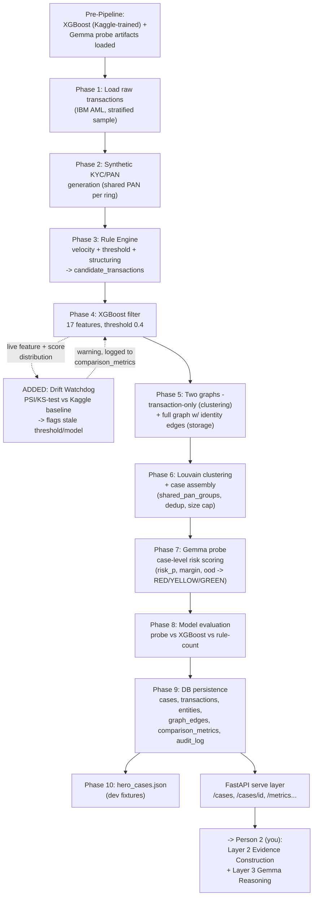

# Person 1 — Full Pipeline, Combined (with Drift Detection added)

```mermaid
flowchart TB
    Pre["Pre-Pipeline:\nXGBoost (Kaggle-trained) +\nGemma probe artifacts loaded"] --> P1["Phase 1: Load raw transactions\n(IBM AML, stratified sample)"]
    P1 --> P2["Phase 2: Synthetic KYC/PAN\ngeneration (shared PAN per ring)"]
    P2 --> P3["Phase 3: Rule Engine\nvelocity + threshold + structuring\n-> candidate_transactions"]

    P3 --> P4["Phase 4: XGBoost filter\n17 features, threshold 0.4"]
    P4 -.->|"live feature + score\ndistribution"| Drift["ADDED: Drift Watchdog\nPSI/KS-test vs Kaggle baseline\n-> flags stale threshold/model"]
    Drift -.->|"warning, logged to\ncomparison_metrics"| P4

    P4 --> P5["Phase 5: Two graphs -\ntransaction-only (clustering)\n+ full graph w/ identity edges (storage)"]
    P5 --> P6["Phase 6: Louvain clustering\n+ case assembly\n(shared_pan_groups, dedup, size cap)"]
    P6 --> P7["Phase 7: Gemma probe\ncase-level risk scoring\n(risk_p, margin, ood -> RED/YELLOW/GREEN)"]
    P7 --> P8["Phase 8: Model evaluation\nprobe vs XGBoost vs rule-count"]
    P8 --> P9["Phase 9: DB persistence\ncases, transactions, entities,\ngraph_edges, comparison_metrics, audit_log"]
    P9 --> P10["Phase 10: hero_cases.json\n(dev fixtures)"]
    P9 --> API["FastAPI serve layer\n/cases, /cases/id, /metrics..."]
    API --> P2Person["-> Person 2 (you):\nLayer 2 Evidence Construction\n+ Layer 3 Gemma Reasoning"]
```
